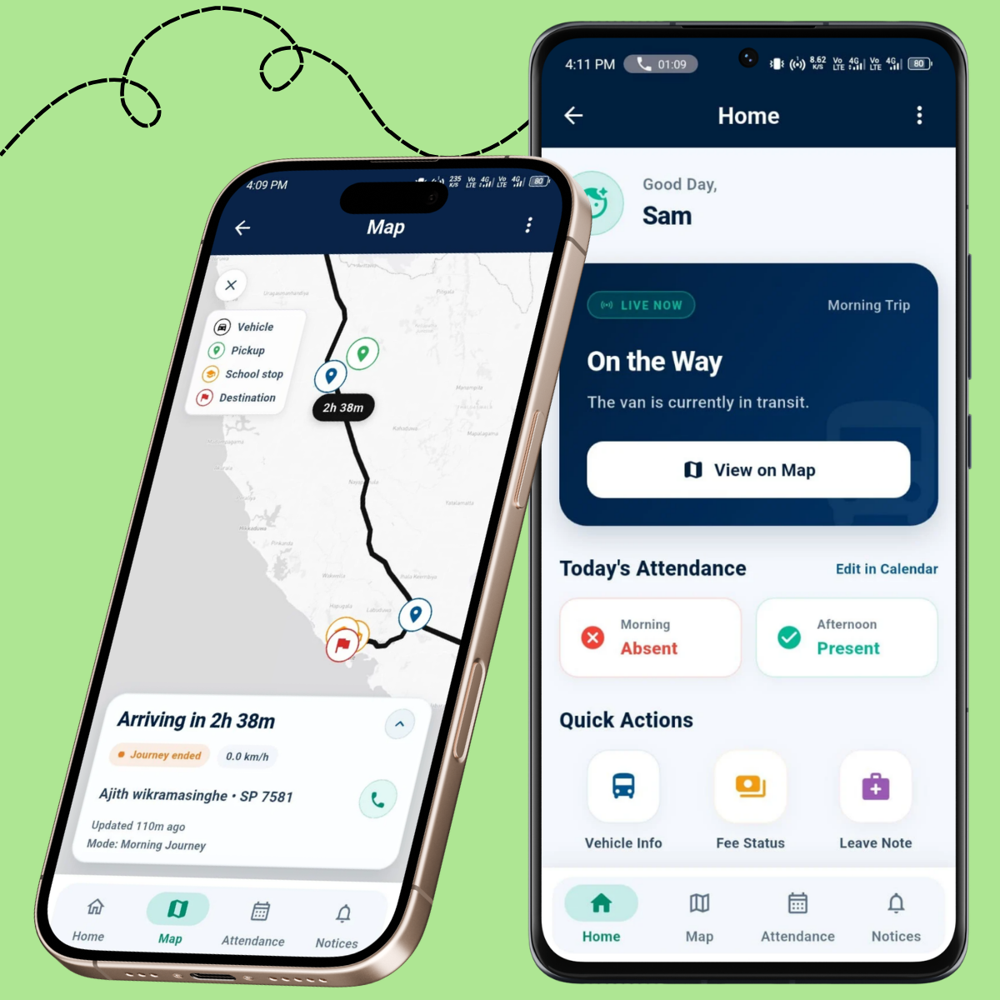
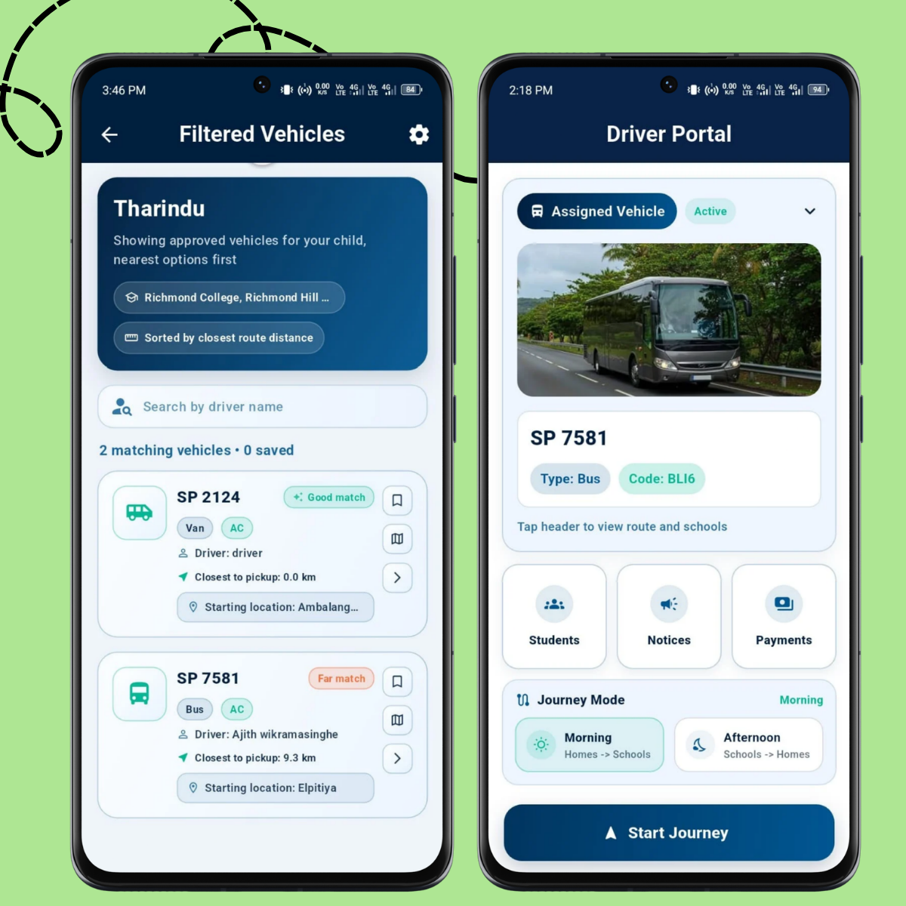
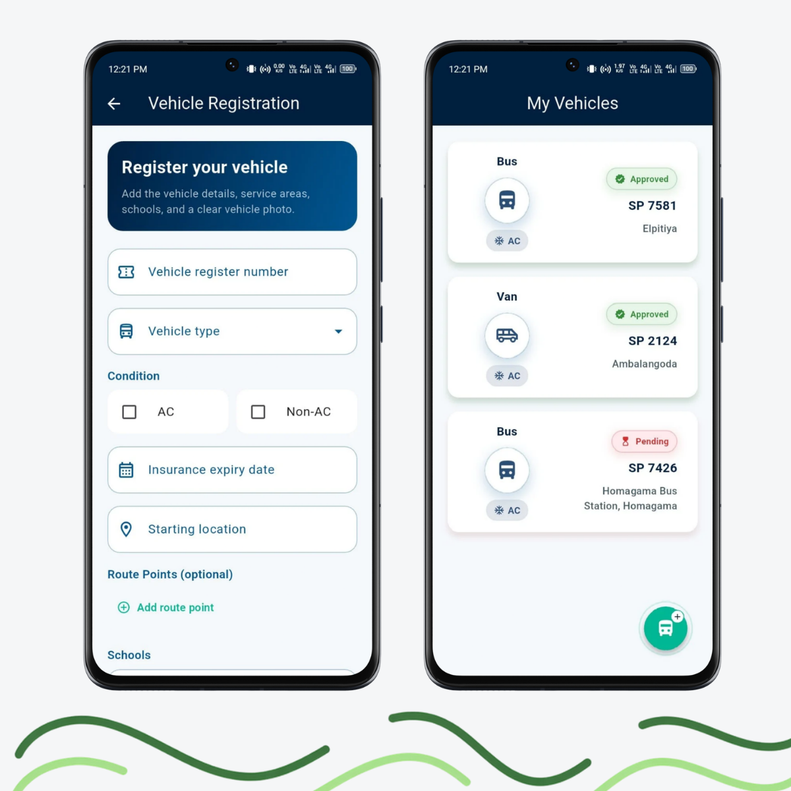
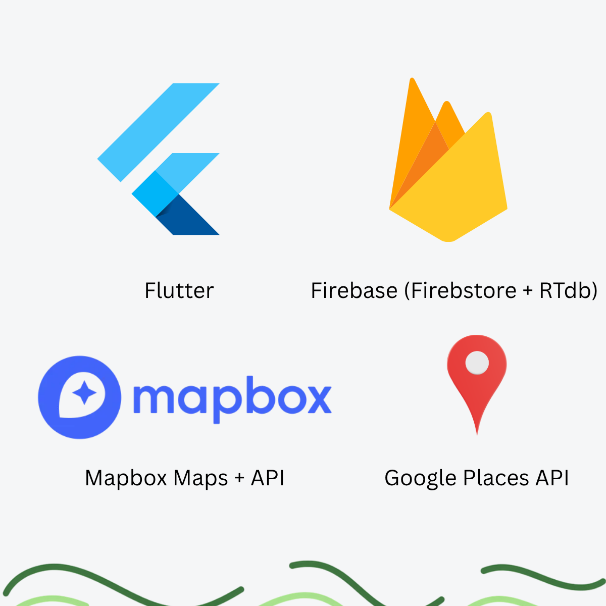

<div align="center">

# 🚌 RideSafe
### *School Transport Live Tracking, Attendance & Fleet Management Platform*

[](https://flutter.dev/)
[](https://dart.dev/)
[](https://firebase.google.com/)
[](https://www.mapbox.com/)
[](https://www.android.com/)
[](LICENSE)

<br/>

### 🎓 University Coursework Project
**Academic Module:** 2nd Year — Computing Group Project (Software Engineering & Mobile Development)  
**Core Competencies:** Android mobile engineering (Flutter/Dart), real-time GPS telemetry (Mapbox), Firebase BaaS & security, and multi-tenant role-based UX.

<br/>

**An Android mobile ecosystem built with Flutter engineered to bridge the critical communication and safety gap between parents, school van drivers, and fleet owners through real-time GPS telemetry, digital attendance check-ins, automated drop-off alerts, and secure in-app fee payments.**

<br/>

</div>

---

## 📌 Executive Summary

School transportation frequently relies on informal, fragmented communication—phone calls, text messages, and manual paper rosters—leading to parent anxiety regarding route delays and student safety.

**RideSafe** solves this by establishing a real-time, tri-party mobile ecosystem:
1. **Parents** gain complete peace of mind with continuous live GPS location tracking, instant arrival/boarding push notifications, and frictionless digital payment management.
2. **Drivers** benefit from distraction-free driving through streamlined route overviews, one-tap student boarding/deboarding attendance, and automated location broadcasting.
3. **Vehicle Owners & Fleet Operators** maintain complete visibility over their vehicles, driver assignments, operational statuses, and student subscription fees.

---

## 📱 User Roles & Feature Walkthrough

### 👨‍👩‍👧‍👦 1. Parent Portal: Live GPS Telemetry & Child Safety

Designed to eliminate morning and afternoon commute uncertainty, the Parent portal provides immediate, transparent access to their child's transit:

* **Real-Time GPS Tracking**: Streams the exact location of the school van on interactive Mapbox vector maps with smooth movement interpolation.
* **Multi-Child Transport Management**: Register and manage multiple children, linking each child to their designated van driver and route.
* **Automated Transit Notifications**: Receive instant push notifications the moment a child boards the van and safely arrives at school or home.
* **In-App Fee Settlement**: Review transport fee invoices, settle payments directly via in-app payment gateways, and track receipt histories.

<br/>
<div align="center">
  
  <p align="center"><sub><b>Figure 1:</b> Parent Dashboard featuring live Mapbox GPS tracking, student attendance status, and quick fee payment options.</sub></p>
</div>
<br/>

---

### 🛞 2. Driver Console: Route Navigation & Digital Attendance

Engineered for distraction-free operation, the Driver portal simplifies daily school transit routes:

* **Live Location Broadcasting**: Automatically broadcasts background geolocation coordinates to subscribed parents during active transit runs.
* **One-Tap Digital Attendance**: Fast, interactive student check-in/check-out roster replacing cumbersome paper clipboards during busy school stops.
* **Turn-by-Turn Waypoints**: Integrated routing assistance displaying scheduled pickup and drop-off waypoints.
* **Payment Ledger**: Instant tracking of pending vs. settled student transport subscription fees.

<br/>
<div align="center">
  
  <p align="center"><sub><b>Figure 2:</b> Driver Console showing daily route stops, one-tap digital attendance, and broadcast status.</sub></p>
</div>
<br/>

---

### 🚐 3. Fleet Owner Hub: Vehicle Registry & Driver Management

Built for commercial school van owners operating multiple transit routes:

* **Fleet Asset Registry**: Centralized dashboard to track vehicle specifications, registration renewals, passenger capacity, and operational condition.
* **Driver-to-Vehicle Allocation**: Dynamically assign verified drivers to specific school routes and passenger rosters.
* **Fleet Operational Status**: Real-time status indicators on active routes, scheduled maintenance, and overall fleet revenue.

<br/>
<div align="center">
  
  <p align="center"><sub><b>Figure 3:</b> Vehicle Owner Dashboard displaying multi-van operations, driver assignments, and vehicle health metrics.</sub></p>
</div>
<br/>

---

## 🏗️ Architecture & Software Design

<div align="center">
<table border="0">
<tr><td align="left">

```
┌─────────────────────────────────────────────────────────────┐
│                       Presentation Layer                    │
│   Parent Screens  •  Driver Dashboard  •  Fleet Owner Portal │
│             (Flutter UI Widgets • Responsive Layouts)        │
└──────────────────────────────┬──────────────────────────────┘
                               │ Streams / Reactive State
┌──────────────────────────────▼──────────────────────────────┐
│                        Service Layer                        │
│   auth_service.dart     •  location_service.dart            │
│   notification_service  •  vehicle_service.dart             │
└──────────────────────────────┬──────────────────────────────┘
                               │
┌──────────────────────────────▼──────────────────────────────┐
│                    Cloud & Telemetry Layer                  │
│    Firebase Auth  •  Cloud Firestore  •  Realtime Database  │
│    Mapbox Navigation SDK  •  Geolocator Platform Channels   │
└─────────────────────────────────────────────────────────────┘
```

</td></tr>
</table>
</div>

<br/>
<div align="center">
  
  <p align="center"><sub><b>Figure 4:</b> Cross-platform client architecture integrated with Firebase BaaS and Mapbox Geolocation services.</sub></p>
</div>
<br/>

### Architectural Highlights
* **Separation of Concerns**: Strict decoupling between presentation UI widgets, stateful domain services, and external API gateways.
* **Optimized Geolocation Telemetry**: `location_service.dart` incorporates adaptive rate-limiting, coordinate debouncing, and movement thresholds to deliver smooth map tracking while conserving mobile battery.
* **Security & Secret Isolation**: All sensitive third-party tokens (Mapbox, Firebase APIs) are decoupled from the codebase into `.env` runtime configuration templates (`mapbox.env.example.json`).
* **Offline Resilience**: Leverages Cloud Firestore local persistence to cache student profiles, contact rosters, and recent route configurations during temporary network dropouts.

---

## 💻 Technology Stack

| Component | Technology | Rationale |
|---|---|---|
| **Frontend Framework** | **Flutter 3 (Dart)** | High-performance compiled native Android mobile application. |
| **Authentication** | **Firebase Auth** | Secure multi-role user session management and credential token validation. |
| **Database & Realtime** | **Cloud Firestore & Realtime DB** | Low-latency NoSQL document persistence and live telemetry streaming. |
| **Maps & Routing** | **Mapbox SDK & Google Maps** | High-fidelity vector maps, custom marker styling, and live vehicle location broadcasting. |
| **Location Services** | **Geolocator** | Android hardware GPS access with runtime permission handling and background location updates. |
| **State Management** | **Provider / StreamBuilder** | Reactive, testable state propagation without unnecessary widget tree rebuilds. |

---

## 👨‍💻 My Role & Key Contributions

As a core developer on this project, I architected and implemented foundational components across the mobile application:

* **Notifications & In-App Payment Architecture**:
  * Built the notification dispatch logic alerting parents when students board or leave vehicles.
  * Formulated payment management workflows linking student IDs to driver fee ledgers.
* **Security Hardening & Secret Management Refactoring**:
  * Led the security refactoring to eliminate hardcoded API keys and tokens across the codebase.
  * Formulated centralized `.env` configuration loaders and standardized `.gitignore` rules for cloud credentials.
* **Geolocation & Mapbox Integration**:
  * Contributed to the stabilization of live location tracking feeds and coordinate broadcasting between driver and parent portals.
* **Administrative & Back-Office Controls**:
  * Built administrative oversight views and driver/vehicle assignment synchronization logic.
* **UI/UX Consistency**:
  * Standardized visual design systems, typography, and responsive widget hierarchy across role-specific dashboards.

---

## 🚀 Getting Started

### Prerequisites
* [Flutter SDK](https://docs.flutter.dev/get-started/install) (Version 3.0 or higher)
* [Dart SDK](https://dart.dev/get-dart) (bundled with Flutter)
* Android Studio (with Android SDK & Emulator)

### Installation & Run

1. **Clone the repository:**
   ```bash
   git clone https://github.com/chinthanasathyajithcs/school_transport_system_mobile_app.git
   cd school_transport_system_mobile_app
   ```

2. **Install Flutter Dependencies:**
   ```bash
   flutter pub get
   ```

3. **Configure Environment Keys:**
   * Duplicate the environment template:
     ```bash
     cp mapbox.env.example.json mapbox.env.json
     ```
   * Populate your Mapbox public token and API configuration keys.

4. **Launch the Application:**
   * Connect an Android device or start an emulator.
   * Run the app in debug mode:
     ```bash
     flutter run
     ```

---

## 📄 License

This project is licensed under the [MIT License](LICENSE) - see the LICENSE file for details.
